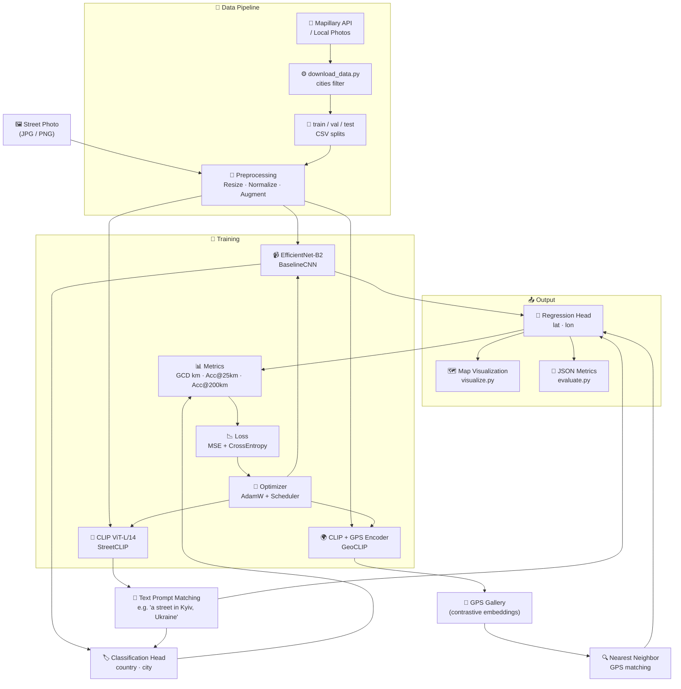

# AI_GeoDetect: Neural Network Geolocation from Street Photography

[](https://www.python.org/downloads/release/python-3100/)
[](https://pytorch.org/)
[](https://opensource.org/licenses/MIT)

---

## About the Project

This is a diploma thesis project focused on developing and comparing neural network architectures for automatic geolocation of street photographs, with an emphasis on Ukraine and neighboring Central and Eastern European countries.

**Task:** Given an input street image, predict the geographic coordinates (latitude & longitude) of the shooting location, as well as classify the image by country and city.

**Three architectures under investigation:**

| Architecture | Base Model | Approach |
|---|---|---|
| `BaselineCNN` | EfficientNet-B2 | Supervised classification + regression |
| `StreetCLIP` | CLIP (ViT-L/14) | Fine-tuning with text prompts |
| `GeoCLIP` | CLIP + GPS encoder | Contrastive learning with GPS gallery |

**Target regions:** Ukraine (Kyiv, Lviv, Odesa, Kharkiv, Dnipro) and neighboring countries — Poland, Czech Republic, Hungary, Austria, Romania, Slovakia.

---

## 🏗️ Architecture



---

## Repository Structure

```
diploma/
├── README.md
├── environment.yml               # Conda environment
├── requirements.txt              # Pip dependencies
├── .gitignore
│
├── configs/
│   ├── config.yaml               # Main configuration
│   ├── baseline_config.yaml      # EfficientNet-B2 baseline
│   └── geoclip_config.yaml       # GeoCLIP contrastive
│
├── data/
│   ├── dataset_manifest_example.csv   # Example dataset manifest
│   ├── images/                        # Input images (not in git)
│   └── splits/                        # train/val/test CSV files
│
├── code/
│   ├── models/                   # Individual model architectures
│   ├── notebooks/                # Jupyter notebooks for EDA & experiments
│   ├── augmentations.py          # Image augmentations
│   ├── dataset.py                # Dataset and DataLoader classes
│   ├── download_data.py          # Image downloader (Mapillary/OSM)
│   ├── evaluate.py               # Evaluation on test set
│   ├── inference.py              # Inference for single/batch photos
│   ├── metrics.py                # Metrics (GCD, Accuracy@km, etc.)
│   ├── models.py                 # Model definitions
│   ├── train.py                  # Main training script
│   ├── utils.py                  # Helper functions
│   └── visualize.py              # Map and chart generation
│
├── writing/                      # Thesis text
│
└── results/
    ├── checkpoints/              # Saved model weights (not in git)
    ├── logs/                     # WandB / MLflow / TensorBoard logs
    └── plots/                    # Saved charts and maps
```

---

## Installation

### Option 1: Conda (Recommended)

```bash
git clone https://github.com/Totsamuychel/AI_GeoDetect.git
cd AI_GeoDetect

conda env create -f environment.yml
conda activate geo-photo

# Verify installation
python -c "import torch; print(torch.__version__, torch.cuda.is_available())"
```

### Option 2: pip + virtualenv

```bash
python -m venv .venv
source .venv/bin/activate       # Linux / macOS
# or
.venv\Scripts\activate          # Windows

pip install --upgrade pip
pip install -r requirements.txt
```

---

## Data Preparation

### 1. Download Images

The script supports Mapillary API and local photo directories as sources.

```bash
# Download images for specified cities via Mapillary API
python code/download_data.py \
    --source mapillary \
    --cities Kyiv Lviv Odesa Kharkiv Dnipro Warsaw Prague Budapest \
    --output data/images/ \
    --max-per-city 5000 \
    --mapillary-token YOUR_TOKEN

# Or import from a local directory
python code/download_data.py \
    --source local \
    --input /path/to/raw/photos \
    --output data/images/
```

---

## Training

### BaselineCNN (EfficientNet-B2)

```bash
python code/train.py \
    --config configs/baseline_config.yaml \
    --model baseline \
    --experiment baseline_efficientnet_b2
```

### StreetCLIP Fine-tuning

```bash
python code/train.py \
    --config configs/config.yaml \
    --model streetclip \
    --experiment streetclip_finetune_01 \
    --pretrained openai/clip-vit-large-patch14
```

### GeoCLIP (Contrastive with GPS Gallery)

```bash
python code/train.py \
    --config configs/geoclip_config.yaml \
    --model geoclip \
    --experiment geoclip_contrast_01 \
    --gallery-size 1000
```

---

## Evaluation

```bash
python code/evaluate.py \
    --config configs/config.yaml \
    --checkpoint results/checkpoints/streetclip_best.pth \
    --model streetclip \
    --output results/metrics/streetclip_test_metrics.json
```

---

## Inference

```bash
python code/inference.py \
    --image path/to/photo.jpg \
    --model streetclip \
    --checkpoint results/checkpoints/streetclip_best.pth \
    --config configs/config.yaml
```

---

## License

This project is distributed under the **MIT** License. See the [LICENSE](LICENSE) file for details.

---

## Citation

```bibtex
@mastersthesis{diploma2026geoloc,
  title     = {Neural Network Geolocation Model from Street Photography of Ukraine},
  author    = {Totsamuychel},
  year      = {2026},
}
```
